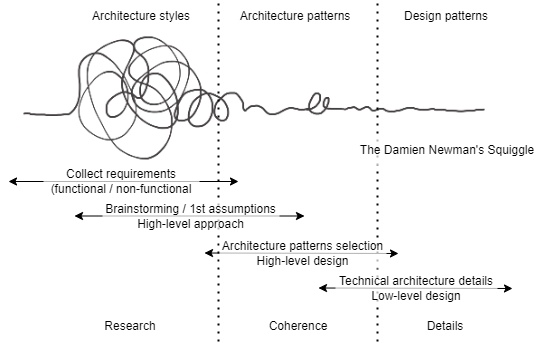
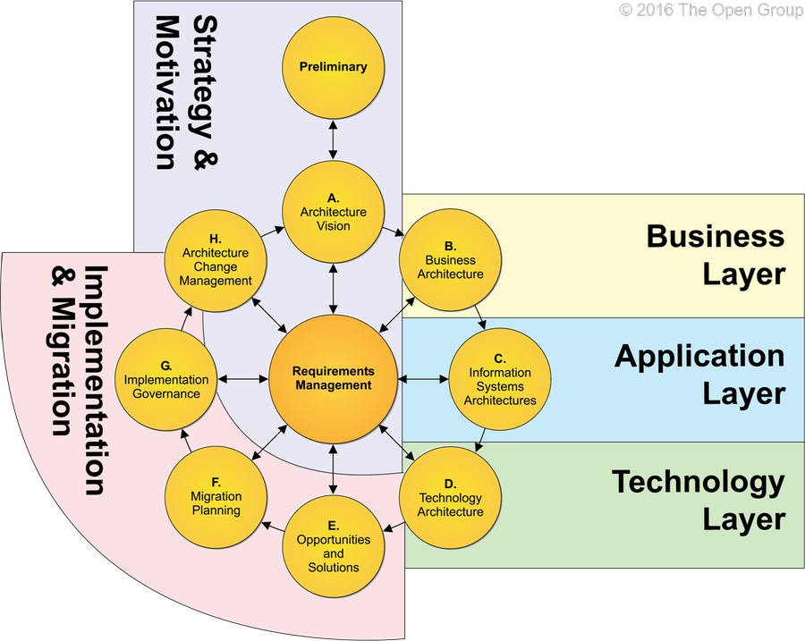

+++
title       = "Markdown syntax"
authors     = [ "Emmanuel" ]
date        = "2025-02-02"
draft       = false
# images      = ["images/edito_logo.jpg"]
description = "Markdown syntax"
tags        = [ "markdown" ]

[sitemap]
  disable = true

[[resources]]
    src = "gallery/20080928_pont_wilson_nuit_007.jpg"
    title = "Autour du Pont Wilson 1/6"

[[resources]]
    src = "gallery/20080928_pont_wilson_nuit_010.jpg"
    title = "Autour du Pont Wilson 2/6"

[[resources]]
    src = "gallery/20080928_pont_wilson_nuit_011.jpg"
    title = "Autour du Pont Wilson 3/6"

[[resources]]
    src = "gallery/20080928_pont_wilson_nuit_013.jpg"
    title = "Autour du Pont Wilson 4/6"

[[resources]]
    src = "gallery/20080928_pont_wilson_nuit_016.jpg"
    title = "Autour du Pont Wilson 5/6"

[[resources]]
    src = "gallery/20080928_pont_wilson_nuit_017.jpg"
    title = "Autour du Pont Wilson 6/6"

[[resources]]
    src = "gallery/20091017_loire_010.jpg"
    title = "Sortie nocturne 1/2"

[[resources]]
    src = "gallery/20091017_loire_011.jpg"
    title = "Sortie nocturne 2/2"

[[resources]]
    src = "gallery/20100313_sortie_photo_tours_007.jpg"
    title = "Promenade en bord de Loire 1/6"

[[resources]]
    src = "gallery/20100313_sortie_photo_tours_009_1.jpg"
    title = "Promenade en bord de Loire 2/6"

[[resources]]
    src = "gallery/20100321_balade_loire_001.jpg"
    title = "Promenade en bord de Loire 2/6"

[[resources]]
    src = "gallery/20100321_balade_loire_005.jpg"
    title = "Promenade en bord de Loire 3/6"

[[resources]]
    src = "gallery/20100406_promenade_bord_loire_006.jpg"
    title = "Promenade en bord de Loire 4/6"

[[resources]]
    src = "gallery/20100406_promenade_bord_loire_020.jpg"
    title = "Promenade en bord de Loire 5/6"

[[resources]]
    src = "gallery/20100425_sortie_loire_001_1.jpg"
    title = "Promenade en bord de Loire 6/6"

[abbr]
    doctor = "A standard doctor"
+++
Markdown syntax
<!--more-->

Headers are used to describe such elements as website name, slogan, section titles. HTML and XHTML specifications define 6 levels of headers, where h1 is the most important and h6 is the least important.
Lorem ipsum odor amet, consectetuer adipiscing elit. Efficitur aenean justo tristique pharetra; blandit hendrerit. Sed fermentum ornare ligula nisl leo vestibulum primis. Aenean non commodo praesent quisque; laoreet donec ad etiam. Tempus aliquet tincidunt sollicitudin proin ad vitae ultrices cubilia. Malesuada facilisi placerat purus orci convallis penatibus sociosqu. Finibus ac integer pellentesque justo taciti.
## Header 2
Lorem ipsum odor amet, consectetuer adipiscing elit. Efficitur aenean justo tristique pharetra; blandit hendrerit. Sed fermentum ornare ligula nisl leo vestibulum primis. Aenean non commodo praesent quisque; laoreet donec ad etiam. Tempus aliquet tincidunt sollicitudin proin ad vitae ultrices cubilia. Malesuada facilisi placerat purus orci convallis penatibus sociosqu. Finibus ac integer pellentesque justo taciti.
### Header 3
Lorem ipsum odor amet, consectetuer adipiscing elit. Efficitur aenean justo tristique pharetra; blandit hendrerit. Sed fermentum ornare ligula nisl leo vestibulum primis. Aenean non commodo praesent quisque; laoreet donec ad etiam. Tempus aliquet tincidunt sollicitudin proin ad vitae ultrices cubilia. Malesuada facilisi placerat purus orci convallis penatibus sociosqu. Finibus ac integer pellentesque justo taciti.
#### Header 4
Lorem ipsum odor amet, consectetuer adipiscing elit. Efficitur aenean justo tristique pharetra; blandit hendrerit. Sed fermentum ornare ligula nisl leo vestibulum primis. Aenean non commodo praesent quisque; laoreet donec ad etiam. Tempus aliquet tincidunt sollicitudin proin ad vitae ultrices cubilia. Malesuada facilisi placerat purus orci convallis penatibus sociosqu. Finibus ac integer pellentesque justo taciti.
##### Header 5
Lorem ipsum odor amet, consectetuer adipiscing elit. Efficitur aenean justo tristique pharetra; blandit hendrerit. Sed fermentum ornare ligula nisl leo vestibulum primis. Aenean non commodo praesent quisque; laoreet donec ad etiam. Tempus aliquet tincidunt sollicitudin proin ad vitae ultrices cubilia. Malesuada facilisi placerat purus orci convallis penatibus sociosqu. Finibus ac integer pellentesque justo taciti.
###### Header 6
Lorem ipsum odor amet, consectetuer adipiscing elit. Efficitur aenean justo tristique pharetra; blandit hendrerit. Sed fermentum ornare ligula nisl leo vestibulum primis. Aenean non commodo praesent quisque; laoreet donec ad etiam. Tempus aliquet tincidunt sollicitudin proin ad vitae ultrices cubilia. Malesuada facilisi placerat purus orci convallis penatibus sociosqu. Finibus ac integer pellentesque justo taciti.

## Links

  [Local link](#)

  [External link](https://test.example.com)

  [External non secured link](http://test.example.com)

  [Github site](https://github.com/)

  [Wikipedia](https://wikipedia.org/)

  [E-mail link](mailto:admin@example.com)

## Block elements

> The blockquote element is used to indicate the quotation of a bigger section of text from another source. Using the default HTML styling of most web browsers, it will indent the right and left margins both on the display and in printed form.
{cite="http://en.wikipedia.org/wiki/Blockquote" caption="Wikipedia, The Free Encyclopedia"}

> [!TIP] Essai
> The blockquote element is used to indicate the quotation of a bigger section of text from another source. Using the default HTML styling of most web browsers, it will indent the right and left margins both on the display and in printed form.
{cite="http://en.wikipedia.org/wiki/Blockquote" caption="Wikipedia, The Free Encyclopedia"}

> [!NOTE]
> The blockquote element is used to indicate the quotation of a bigger section of text from another source. Using the default HTML styling of most web browsers, it will indent the right and left margins both on the display and in printed form.
{cite="http://en.wikipedia.org/wiki/Blockquote" caption="Wikipedia, The Free Encyclopedia"}

> [!IMPORTANT] Essai
> The blockquote element is used to indicate the quotation of a bigger section of text from another source. Using the default HTML styling of most web browsers, it will indent the right and left margins both on the display and in printed form.
{cite="http://en.wikipedia.org/wiki/Blockquote" caption="Wikipedia, The Free Encyclopedia"}

> [!WARNING] Essai
> The blockquote element is used to indicate the quotation of a bigger section of text from another source. Using the default HTML styling of most web browsers, it will indent the right and left margins both on the display and in printed form.
{cite="http://en.wikipedia.org/wiki/Blockquote" caption="Wikipedia, The Free Encyclopedia"}

> [!CAUTION] Essai
> The blockquote element is used to indicate the quotation of a bigger section of text from another source. Using the default HTML styling of most web browsers, it will indent the right and left margins both on the display and in printed form.> 

> The blockquote element is used to indicate the quotation of a bigger section of text from another source. Using the default HTML styling of most web browsers, it will indent the right and left margins both on the display and in printed form.


## Preformated text

```
      .               .                .               .--- 1          .-- 1     / 1
     / \              |                |           .---+            .-+         +
    /   \         .---+---.         .--+--.        |   '--- 2      |   '-- 2   / \ 2
   +     +        |       |        |       |    ---+            ---+          +
  / \   / \     .-+-.   .-+-.     .+.     .+.      |   .--- 3      |   .-- 3   \ / 3
 /   \ /   \    |   |   |   |    |   |   |   |     '---+            '-+         +
 1   2 3   4    1   2   3   4    1   2   3   4         '--- 4          '-- 4     \ 4
```

## Code

```javascript
if (typeof SimpleLightbox !== "undefined") {
    var matches = document.querySelectorAll(".gallery");
    matches.forEach(
        gal => {
            new SimpleLightbox("#" + gal.id + " a");
        }
    );
    /*var matches = document.querySelectorAll(".figure");
    matches.forEach(
        fig => {
            new SimpleLightbox("#" + fig.id + " a");
        }
    );*/
    new SimpleLightbox(".figure a");
}
```

## Typography elements

**Emphasis**: Element used to *put emphasis on certain information*. Most browsers display emphasized text in italics by default.
Sample: *This is emphasized text*.

This element stands for “stronger emphasis” and is used for marking more important text.
Sample: **This is text with stronger emphasis**

According to *W3C specification*, we use `cite` element to define source of a quotation or reference.
Sample: *This is quotation source*

Element used to markup inline definition of a single term.
Sample: *This is definition*

This element informs the browser that it contains a computer code, such as XHTML markup.
Sample: `document.write("Hello world");`

Defines computer output data, for example we can use it to markup error messages
Sample: `Error: no such file or directory`

Abbreviation / a shortened form of a word or phrase
Sample: 

<ins title="Added new information according to suggestions" datetime="2009-07-12T08:15:30+02:00">
This information was just added.

~~While this information is no longer valid~~ 

**Bold text**

*Italic text*

==Highlight==

Inserted text	++bar++

H~2~O,

E = mc^2^,

The 14^th^ of September

## Lists

- Apple
- Pear
- Banana
- Orange
- Carrot

Lorem ipsum odor amet, consectetuer adipiscing elit. Efficitur aenean justo tristique pharetra; blandit hendrerit. Sed fermentum ornare ligula nisl leo vestibulum primis. Aenean non commodo praesent quisque; laoreet donec ad etiam. Tempus aliquet tincidunt sollicitudin proin ad vitae ultrices cubilia. Malesuada facilisi placerat purus orci convallis penatibus sociosqu. Finibus ac integer pellentesque justo taciti.

- Apple
    - Golden Delicious
    - Granny Smith
    - Idared
    - McIntosh
- Pear
- Banana
- Orange
- Carrot

Lorem ipsum odor amet, consectetuer adipiscing elit. Efficitur aenean justo tristique pharetra; blandit hendrerit. Sed fermentum ornare ligula nisl leo vestibulum primis. Aenean non commodo praesent quisque; laoreet donec ad etiam. Tempus aliquet tincidunt sollicitudin proin ad vitae ultrices cubilia. Malesuada facilisi placerat purus orci convallis penatibus sociosqu. Finibus ac integer pellentesque justo taciti.

- [Apple](https://www.example.com)
- [Golden Delicious](https://www.example.com)
  - [Granny Smith](https://www.example.com)
  - [Idared](https://www.example.com)
- [McIntosh](https://www.example.com)
- [Apple](https://www.example.com)

Lorem ipsum odor amet, consectetuer adipiscing elit. Efficitur aenean justo tristique pharetra; blandit hendrerit. Sed fermentum ornare ligula nisl leo vestibulum primis. Aenean non commodo praesent quisque; laoreet donec ad etiam. Tempus aliquet tincidunt sollicitudin proin ad vitae ultrices cubilia. Malesuada facilisi placerat purus orci convallis penatibus sociosqu. Finibus ac integer pellentesque justo taciti.

1. First
1. Second
    1. sub 1
    1. sub 2
1. Third
    - item
    - item
1. Fourth

Lorem ipsum odor amet, consectetuer adipiscing elit. Efficitur aenean justo tristique pharetra; blandit hendrerit. Sed fermentum ornare ligula nisl leo vestibulum primis. Aenean non commodo praesent quisque; laoreet donec ad etiam. Tempus aliquet tincidunt sollicitudin proin ad vitae ultrices cubilia. Malesuada facilisi placerat purus orci convallis penatibus sociosqu. Finibus ac integer pellentesque justo taciti.

Definition List Title
  : This is a definition list division.
Inkscape
  : Open Source vector graphics editor
SVG
  : Scalable Vector Graphics
W3C standard
  : GIMP
  : X
GNU Image Manipulation Program
  : Drupal

## Paragraphs

According to Wikipedia: a paragraph (from the Greek [paragraphos][#], “to write beside” or “written beside”) is a self-contained unit of a discourse in writing dealing with a particular point or idea. The start of a paragraph is indicated by beginning on a new line. Sometimes the first line is indented; sometimes it is indented without beginning a new line.

A paragraph typically consists of a unifying main point, thought, or idea accompanied by supporting details. The non-fiction paragraph usually begins with the general and moves towards the more specific so as to advance an argument or point of view. Each paragraph builds on what came before and lays the ground or run the length of multiple pages, and may consist of one or many sentences. When dialogue is being quoted in fiction, a new paragraph is used each time the person being quoted changed.

In (X)HTML, the p element marks a block of text as a paragraph – the opening tag &lt;p&gt; marks the beginning of a paragraph, and the closing tag &lt;/p&gt; marks the end of a paragraph. The end tag is optional for legacy HTML as the browser automatically starts another paragraph at the next &lt;p&gt; tag, or the nextblock element.

Here's a simple footnote,[^1] and here's a longer one.[^bignote]
[^1]: This is the first footnote.
[^bignote]: Here's one with multiple paragraphs and code.
    Indent paragraphs to include them in the footnote.
    `{ my code }`
    11 Add as many paragraphs as you like.

## Tables

| Mauris | Tempor | Present Lacus Nulla | Quis |
| ----------- |:----------- |:----------- |:----------- |
| Mauris | 23.000 | Suspendisse viverra | Yes |
| Trupis | 1.000 | Placerat tortor aesent semper | No |
| Sagittis | 122.000 | Neque vel condimentum | No |
| Libero | 500 | Hendrerit, lectus elit pretium | Yes |
| Tristique | 100.000 | Ligula nec consequat | Yes |
| Id Neque | 600.000 | Etiam sodales orci nec | No |

| Mauris | Tempor | Present Lacus Nulla | Quis |
| ----------- | -----------:| -----------:| -----------:|
| Mauris | 23.000 | Suspendisse viverra | Yes |
| Trupis | 1.000 | Placerat tortor aesent semper | No |
| Sagittis | 122.000 | Neque vel condimentum | No |
| Libero | 500 | Hendrerit, lectus elit pretium | Yes |
| Tristique | 100.000 | Ligula nec consequat | Yes |
| Id Neque | 600.000 | Etiam sodales orci nec | No |

| Mauris | Tempor | Present Lacus Nulla | Quis |
| ----------- |:-----------:|:-----------:|:-----------:|
| Mauris | 23.000 | Suspendisse viverra | Yes |
| Trupis | 1.000 | Placerat tortor aesent semper | No |
| Sagittis | 122.000 | Neque vel condimentum | No |
| Libero | 500 | Hendrerit, lectus elit pretium | Yes |
| Tristique | 100.000 | Ligula nec consequat | Yes |
| Id Neque | 600.000 | Etiam sodales orci nec | No |

## Images

### Small images



### Big images



### Gallery



